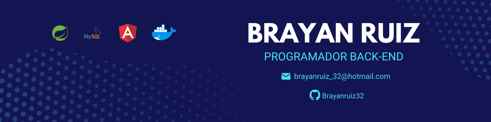

<h2>¡Hola! Soy Brayan Ruiz</h2>

<!-- ## 👋 &nbsp;Hey there! I'm Aditya -->

### 👨🏻‍💻 &nbsp;Sobre mí

💡 &nbsp;Soy curioso y la programación es aquello que alimenta mi esa curiosidad día a día\
🎓 &nbsp;Soy bachiller de la carrera de Ingeniería de Sistemas e Informática.\
🌱 &nbsp;Uno de mis objetivos es el crecimiento continuo y profesional dentro del ecosistema de Java y sus herramientas que la comprenden.\
✍️ &nbsp;En mis ratos libres, leo acerca de patrones de diseño y es lo que actualmente estoy aprendiendo.\
💬 &nbsp;Siéntete libre de conectar conmigo en alguna de mis redes sociales y estaré dispuesto a ayudarnos.\

### 🛠 &nbsp;Tecnologías

####  Front-End

### Back-End

### Database

### Cloud

### ⚙️ &nbsp;GitHub Analytics

### 🤝🏻 &nbsp;Connect with Me

-----
Credits: [Aditya Vikram Singh](https://github.com/AVS1508)

Last Edited on: 11/12/2020
